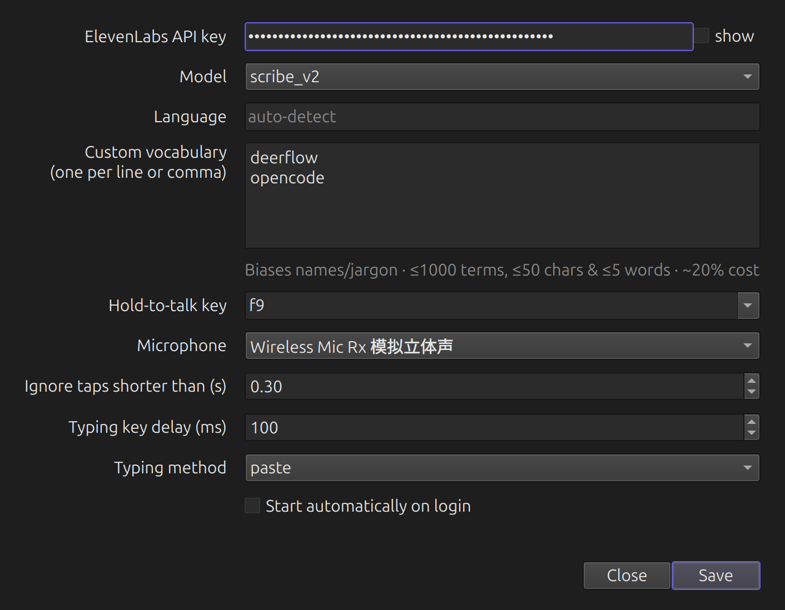

<div align="center">

# 🐦 Ba-Ge · 八哥

**Push-to-talk voice dictation, tuned for bilingual 中 ↔ EN speech — powered by [ElevenLabs Scribe](https://elevenlabs.io/speech-to-text).**

Hold a key, speak, release → your words appear at the cursor. \
Named after the *mynah bird* (八哥), a natural multilingual mimic.

[](LICENSE)
-333)




</div>

```
[hold F9]  speak…  [release]  →  ElevenLabs Scribe  →  text pasted at the cursor
```

It also transcribes audio files with **speaker labels + timestamps** (diarization).

> **Platforms:** Linux (X11) — fully tested. The code is cross-platform (Qt +
> pynput), so macOS/Windows are in reach, but they're **unverified on hardware** —
> see [`docs/PORTING.md`](docs/PORTING.md).

## Why ElevenLabs Scribe?

I built this specifically around Scribe for one reason: **it's genuinely good at
professional Chinese–English bilingual speech.**

Most of my dictation is code-switching — technical English terms dropped into
Mandarin sentences, product names, domain jargon. For a hold-to-talk tool, two
things matter: **speed** (the text should appear the moment you release the key)
and **accuracy on professional terms**. In my own day-to-day testing, the usual
options each miss one of those:

- **Qwen-ASR / FireRedASR** — very accurate on Mandarin, but they're **LLM-based, so
  they're slow** — a real problem for live dictation, where you don't want to wait
  seconds after every phrase.
- **OpenAI Whisper** — **fast**, but it drops professional/technical terms and proper
  nouns, with no vocabulary biasing to correct them — and it garbles dense
  Chinese↔English switch points.
- **ElevenLabs Scribe** — **fast enough for live dictation** *and* clean on
  mixed-language speech, and its **custom-vocabulary biasing** (keyterms) locks in
  product names and jargon across *both* languages.

So Scribe is the one that's both quick *and* right on bilingual professional speech —
which is exactly why this project exists. (Monolingual? A local/open model may suit
you better.)

## Features

- **Hold-to-talk dictation** — hold F9 (configurable), speak, release; the
  transcript is typed at the cursor.
- **Clipboard-free typing** — injects keystrokes via **ydotool** (`/dev/uinput`),
  so it works on **X11 *and* Wayland** and **never touches your clipboard**.
- **File transcription** — mp3 / wav / m4a / flac / ogg → full transcript with
  **speaker labels + timestamps** (ElevenLabs diarization).
- **Custom vocabulary** — bias recognition toward names, jargon, and product terms
  (applies to live dictation *and* files, across both languages).
- **Native Qt tray + settings UI**, desktop notifications, autostart-on-login.
- **Self-contained** — bundles its own Python + Qt. The `.deb` needs no system
  Python, `python3-tk`, or PyGObject.

## Requirements

- An **ElevenLabs API key** — create one at
  [elevenlabs.io](https://elevenlabs.io) (Profile → API Keys).
- Linux — **X11 or Wayland**. A tray host is needed for the indicator icon
  (on GNOME, the *AppIndicator/StatusNotifier* support extension).

## Install

```bash
git clone <your-repo-url> ba-ge
cd ba-ge
./install.sh
```

`install.sh` does everything and is idempotent (safe to re-run). It installs a few
CLI/X libraries via `apt`, then sets up a **self-contained Python** (a uv-managed
standalone interpreter) + **PySide6 (Qt)** in `.venv` — it never installs into or
touches your **system** Python, and needs no `python3-tk` or PyGObject. `uv` is
auto-installed if it's missing.

Then open **Activities → Ba-Ge** (or run `ba-ge`; `~/.local/bin` is
on PATH for most shells). Right-click the tray icon → **Settings** to paste your
API key.

**apt packages it installs:** `ydotool ffmpeg alsa-utils libnotify-bin
libxcb-cursor0`. `install.sh` also sets up **ydotoold** (the ydotool daemon) and
`/dev/uinput` access — which adds you to the `input` group, so **log out and back in
once** after the first install for typing to work. The Python packages (PySide6,
pynput, …) go into the standalone `.venv`.

### Or a native package (`.deb`)

For an `apt`-managed install (and `apt remove` to uninstall), build a fully
self-contained `.deb` that bundles its own Python + Qt — no `python3-*` at all:

```bash
./build-deb.sh
sudo apt install ./dist/ba-ge_*.deb
```

It's ~55 MB (the price of bundling Python + Qt) and depends only on
`ydotool alsa-utils ffmpeg libxcb-cursor0` (its postinst wires up `/dev/uinput`).

## Usage

### Dictate

Focus any text field, **hold F9**, speak, **release**. After a short pause
(transcription runs on release), the text is typed in. The tray icon shows state:
grey (idle) → red (recording) → yellow (transcribing).

### Settings

Right-click the tray icon → **Settings…**, or run `ba-ge --settings`. You
can set your **API key**, model, language, **custom vocabulary**, **hold-to-talk
key**, **microphone**, tap threshold, typing key delay, and **autostart on login**.
Saving applies live to a running app.

The API key can also come from the environment (takes precedence over the file):

```bash
export ELEVENLABS_API_KEY=sk-...
```

### Custom vocabulary (key terms)

Add domain jargon, product/brand names, or proper nouns (one per line or comma-
separated) to bias Scribe toward recognizing them — it applies to both live
dictation and file transcription, and across languages. It's context-aware biasing,
not a forced dictionary.

> ElevenLabs adds **~20% to each call's cost** while key terms are set. Limits:
> ≤1000 terms, ≤50 chars and ≤5 words each (the app validates and warns).

### Transcribe an audio file

Right-click the tray → **Transcribe file…** → pick a file. A window shows progress,
then the diarized transcript with **Copy** / **Save…** buttons:

```
[00:00] Speaker 1: Hello everyone, welcome to the show.
[00:12] Speaker 2: Thanks for having me.
```

Or headless from the CLI (writes `<name>.txt` next to the source, prints its path):

```bash
ba-ge --transcribe interview.m4a      # → interview.txt
```

`ffmpeg` down-mixes the file to a small 16 kHz mono clip before upload, so even long
recordings transfer quickly.

## Configuration

`~/.config/ba-ge/config.toml` (created on first run; see
`config.example.toml`):

| Setting | Default | Meaning |
|---|---|---|
| `elevenlabs.api_key` | placeholder | ElevenLabs API key (`ELEVENLABS_API_KEY` env var overrides) |
| `elevenlabs.model_id` | `scribe_v2` | Scribe model |
| `elevenlabs.language_code` | auto | force a language, e.g. `eng`, `zho` |
| `elevenlabs.keyterms` | (none) | bias vocabulary, e.g. `["Kubernetes", "小红书"]` (~20% cost) |
| `hotkey.key` | `f9` | hold-to-talk key (`f9`, `pause`, `ctrl_r`, …) |
| `audio.device` | `default` | input device (follows the PipeWire default mic) |
| `audio.min_duration` | `0.3` | ignore taps shorter than this (seconds) |
| `inject.backend` | `ydotool` | keystroke injection via `/dev/uinput` (X11 + Wayland) |
| `inject.key_delay_ms` | `20` | per-keystroke delay; raise if characters drop |

## How it works

Recording runs while F9 is held; transcription happens on release (batch), so
expect a ~0.5–2 s pause before the text appears.

| Module | Role |
|---|---|
| `app.py` | state machine + threading wiring |
| `platform.py` | per-OS backend factory (the only place with `sys.platform`) |
| `hotkey.py` / `debounce.py` | global hotkey press/release (pynput) |
| `audio.py` / `audio_sd.py` | mic capture — `arecord` (Linux) / `sounddevice` (mac/win) |
| `transcribe.py` | audio → text / diarized via ElevenLabs Scribe (stdlib HTTP) |
| `filejob.py` | file → `ffmpeg` → Scribe (diarized) → speaker/timestamp text |
| `inject.py` / `inject_pynput.py` | type text — **ydotool** (Linux, X11 + Wayland) / clipboard-paste (mac/win) |
| `ui.py` · `theme.py` · `ui_settings.py` · `ui_files.py` | **PySide6 (Qt)** tray + windows (self-contained, gi-free) |
| `config.py` · `paths.py` · `notify.py` · `singleton.py` · `autostart.py` | config, paths, notifications, single-instance, autostart |

**Design note:** the whole UI (tray + windows) is Qt. Qt's wheels are
self-contained and `QSystemTrayIcon` speaks StatusNotifier natively, which is what
lets the app ship its own Python with no `python3-tk`/PyGObject and still show a
GNOME tray. All threads marshal UI work onto the Qt main thread via a signal bridge.

## Troubleshooting

- **Nothing types at the cursor** — ydotool needs the **ydotoold** daemon and
  `/dev/uinput` access. `install.sh`/the `.deb` set both up; if you *just* installed,
  **log out and back in** (the `input` group needs a fresh session). Check the daemon:
  `systemctl --user status ydotoold`.
- **First character dropped** — ydotoold isn't running (daemonless ydotool drops the
  first key). Start it: `systemctl --user start ydotoold`.
- **Silent recording / empty transcript** — the mic is muted or the wrong device is
  selected; the app warns you. Pick the right mic in **Settings → Microphone**.
- **No app logo after install** — log out and back in once (or `Alt+F2` → `r` on
  X11) to refresh GNOME Shell's icon cache.
- **No tray icon on GNOME** — enable the *AppIndicator / StatusNotifier* support
  extension.
- **Hotkey conflicts with another app** — change it in **Settings → Hold-to-talk
  key**.

## Development

```bash
# run from source (uses the .venv install.sh created)
.venv/bin/python -m ba_ge

# tests
.venv/bin/python -m unittest discover -s tests -v
```

## License

[MIT](LICENSE) © 2026 Xingbang Liu
