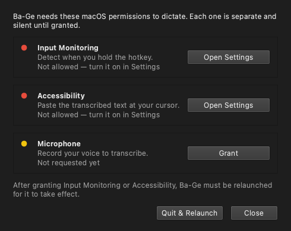

<div align="center">

# 🐦 Ba-Ge · 八哥

**Push-to-talk voice dictation, tuned for bilingual 中 ↔ EN speech — powered by [ElevenLabs Scribe](https://elevenlabs.io/speech-to-text).**

Hold (or tap) a key, speak → your words appear at the cursor. \
Named after the *mynah bird* (八哥), a natural multilingual mimic.

[](LICENSE)


</div>

```
[hold cmd_r]  speak…  [release]  →  ElevenLabs Scribe  →  text pasted at the cursor
```

It also transcribes audio files with **speaker labels + timestamps** (diarization).

> **Platforms:** **Linux (X11)** and **macOS (Apple Silicon)** are both working and
> tested on hardware. One codebase (Qt + pynput) with per-OS backends; **Windows** is
> wired but unverified — see [`docs/PORTING.md`](docs/PORTING.md).

## Why ElevenLabs Scribe?

I built this specifically around Scribe for one reason: **it's genuinely good at
professional Chinese–English bilingual speech.**

Most of my dictation is code-switching — technical English terms dropped into
Mandarin sentences, product names, domain jargon. For a hold-to-talk tool, two
things matter: **speed** (the text should appear the moment you release the key)
and **accuracy on professional terms**. In my own day-to-day testing, the usual
options each miss one of those:

- **Qwen-ASR / FireRedASR** — very accurate on Mandarin, but they're **LLM-based, so
  they're slow** — a real problem for live dictation, where you don't want to wait
  seconds after every phrase.
- **OpenAI Whisper** — **fast**, but it drops professional/technical terms and proper
  nouns, with no vocabulary biasing to correct them — and it garbles dense
  Chinese↔English switch points.
- **ElevenLabs Scribe** — **fast enough for live dictation** *and* clean on
  mixed-language speech, and its **custom-vocabulary biasing** (keyterms) locks in
  product names and jargon across *both* languages.

So Scribe is the one that's both quick *and* right on bilingual professional speech —
which is exactly why this project exists. (Monolingual? A local/open model may suit
you better.)

## Features

- **Hold- or tap-to-talk dictation** — **hold** the hotkey (push-to-talk) or switch
  to **toggle** mode (tap once to start, tap again to stop); speak, and the
  transcript is pasted at the cursor.
- **Record any hotkey** — click **⌨ Record** in Settings and press the key you want:
  function keys, `space`, `caps_lock`, or a left/right modifier like right ⌘ / right
  Ctrl. (Right ⌘ is the cleanest push-to-talk key — it types nothing while held.)
- **Instant paste injection** — inserts the whole transcript in one shot (no slow
  per-key typing); on Linux it auto-uses **Ctrl+Shift+V** in terminals.
- **Clipboard preserved** — a built-in manager restores your previous clipboard
  after each paste, so dictation never clobbers what you copied; it also keeps a
  small **history stack** (tray → *Clipboard history*).
- **File transcription** — mp3 / wav / m4a / flac / ogg → full transcript with
  **speaker labels + timestamps** (ElevenLabs diarization).
- **Custom vocabulary** — bias recognition toward names, jargon, and product terms
  (applies to live dictation *and* files, across both languages).
- **Native Qt tray + settings UI**, desktop notifications, autostart-on-login.
- **macOS: guided permissions + code signing** — a built-in panel walks you through
  the three TCC grants (Input Monitoring, Accessibility, Microphone) with live status;
  `build-macos.sh` produces a **signed, hardened-runtime `.app`** so those grants
  persist, and `build-dmg.sh` packages a drag-to-Applications `.dmg`.
- **Self-contained** — bundles its own Python + Qt. The Linux `.deb` needs no system
  Python, `python3-tk`, or PyGObject; the macOS `.app` bundles everything too.

## Requirements

- An **ElevenLabs API key** — create one at
  [elevenlabs.io](https://elevenlabs.io) (Profile → API Keys).
- **Linux** with **X11** (the paste keystroke is injected via `uinput`; terminal
  detection is X11). A tray host is needed for the indicator icon (on GNOME, the
  *AppIndicator/StatusNotifier* support extension), **or**
- **macOS** (Apple Silicon tested). Dictation needs three one-time permission grants
  — Input Monitoring, Accessibility, Microphone — which the app guides you through.

## Install (Linux)

```bash
git clone <your-repo-url> ba-ge
cd ba-ge
./install.sh
```

`install.sh` does everything and is idempotent (safe to re-run). It installs a few
CLI/X libraries via `apt`, then sets up a **self-contained Python** (a uv-managed
standalone interpreter) + **PySide6 (Qt)** in `.venv` — it never installs into or
touches your **system** Python, and needs no `python3-tk` or PyGObject. `uv` is
auto-installed if it's missing.

Then open **Activities → Ba-Ge** (or run `ba-ge`; `~/.local/bin` is
on PATH for most shells). Right-click the tray icon → **Settings** to paste your
API key.

**apt packages it installs:** `ffmpeg alsa-utils libnotify-bin libxcb-cursor0` —
plain CLI/X libs (the last is what Qt's xcb plugin needs). No injection tools are
needed: the clipboard is Qt's, and the paste keystroke is injected via **uinput**
(bundled `evdev`). `install.sh` adds a udev `uaccess` rule so `/dev/uinput` is
reachable **without** the `input` group or a re-login. Python packages go into `.venv`.

### Or a native package (`.deb`)

For an `apt`-managed install (and `apt remove` to uninstall), build a fully
self-contained `.deb` that bundles its own Python + Qt — no `python3-*` at all:

```bash
./build-deb.sh
sudo apt install ./dist/ba-ge_*.deb
```

It's ~55 MB (the price of bundling Python + Qt) and depends only on
`alsa-utils ffmpeg libxcb-cursor0`.

## Install (macOS)

Build a self-contained `.app` (requires a uv-managed Python + Xcode command-line
tools):

```bash
uv venv --python 3.12 .venv && uv pip install -r requirements.txt
./build-macos.sh          # → a signed .app in ~/Applications, and a .dmg via build-dmg.sh
```

`build-macos.sh` auto-signs with an **Apple Development** certificate if it finds one
(`security find-identity -v -p codesigning`), enabling the hardened runtime + the
microphone entitlement so **your permission grants persist across rebuilds**, and
deploys to `~/Applications/Ba-Ge.app`. Then `./build-dmg.sh` makes a
drag-to-Applications `.dmg`.

On first launch, grant the three permissions Ba-Ge needs (it opens a guided panel):

<div align="center">

</div>

> **Distributing to other Macs** (open without an "unidentified developer" warning)
> needs a **Developer ID Application** certificate + notarization — `build-dmg.sh`
> prints the exact `notarytool` steps. An unsigned/ad-hoc build works on your own Mac
> but resets its grants on every rebuild, which is why signing matters. See
> [`docs/PORTING.md`](docs/PORTING.md) for the full macOS notes.

## Usage

### Dictate

Focus any text field, **hold the hotkey** (default `f9` on Linux, `cmd_r` / right ⌘
on macOS), speak, **release**. After a short pause (transcription runs on release),
the text is pasted in. The tray icon shows state: grey (idle) → red (recording) →
yellow (transcribing).

Prefer not to hold a key? Switch **Recording mode → Toggle** in Settings: **tap** the
hotkey to start, **tap again** to stop.

### Settings

Right-click the tray icon → **Settings…**, or run `ba-ge --settings`. You can set your
**API key**, model, language, **custom vocabulary**, **hotkey** (type it, pick from
the list, or click **⌨ Record** and press the key you want), **recording mode**
(hold / toggle), **microphone**, tap threshold, and **autostart on login**. Saving
applies live to a running app. On macOS, a **Permissions…** entry (tray + a Settings
banner) opens the guided grants panel.

The API key can also come from the environment (takes precedence over the file):

```bash
export ELEVENLABS_API_KEY=sk-...
```

### Custom vocabulary (key terms)

Add domain jargon, product/brand names, or proper nouns (one per line or comma-
separated) to bias Scribe toward recognizing them — it applies to both live
dictation and file transcription, and across languages. It's context-aware biasing,
not a forced dictionary.

> ElevenLabs adds **~20% to each call's cost** while key terms are set. Limits:
> ≤1000 terms, ≤50 chars and ≤5 words each (the app validates and warns).

### Transcribe an audio file

Right-click the tray → **Transcribe file…** → pick a file. A window shows progress,
then the diarized transcript with **Copy** / **Save…** buttons:

```
[00:00] Speaker 1: Hello everyone, welcome to the show.
[00:12] Speaker 2: Thanks for having me.
```

Or headless from the CLI (writes `<name>.txt` next to the source, prints its path):

```bash
ba-ge --transcribe interview.m4a      # → interview.txt
```

`ffmpeg` down-mixes the file to a small 16 kHz mono clip before upload, so even long
recordings transfer quickly.

## Configuration

`~/.config/ba-ge/config.toml` on Linux, `~/Library/Application
Support/ba-ge/config.toml` on macOS (created on first run; see
`config.example.toml`):

| Setting | Default | Meaning |
|---|---|---|
| `elevenlabs.api_key` | placeholder | ElevenLabs API key (`ELEVENLABS_API_KEY` env var overrides) |
| `elevenlabs.model_id` | `scribe_v2` | Scribe model |
| `elevenlabs.language_code` | auto | force a language, e.g. `eng`, `zho` |
| `elevenlabs.keyterms` | (none) | bias vocabulary, e.g. `["Kubernetes", "小红书"]` (~20% cost) |
| `hotkey.key` | `f9` | trigger key (`f9`, `space`, `cmd_r`, `ctrl_r`, `caps_lock`, …) |
| `hotkey.mode` | `hold` | `hold` = push-to-talk · `toggle` = tap on / tap off |
| `audio.device` | `default` | input device (follows the PipeWire / system default mic) |
| `audio.min_duration` | `0.3` | ignore taps shorter than this (seconds) |
| `inject.backend` | `paste` | paste at cursor; atomic + clipboard-preserving |

## How it works

Recording runs while the hotkey is held (or between taps in toggle mode);
transcription happens when it stops (batch), so expect a ~0.5–2 s pause before the
text appears.

| Module | Role |
|---|---|
| `app.py` | state machine + threading wiring (hold / toggle logic) |
| `platform.py` | per-OS backend factory (the only place with `sys.platform`); macOS Qt-plugin + TCC-permission helpers |
| `hotkey.py` / `debounce.py` | global hotkey press/release (pynput) |
| `audio.py` / `audio_sd.py` | mic capture — `arecord` (Linux) / `sounddevice` (mac/win) |
| `transcribe.py` | audio → text / diarized via ElevenLabs Scribe (stdlib HTTP) |
| `filejob.py` | file → `ffmpeg` → Scribe (diarized) → speaker/timestamp text |
| `inject.py` · `clipboard.py` / `inject_pynput.py` | paste at cursor — Qt clipboard + **uinput** keystroke (Linux, X11) / clipboard-paste (mac/win) |
| `ui.py` · `theme.py` · `ui_settings.py` · `ui_files.py` · `ui_clipboard.py` · `ui_permissions.py` | **PySide6 (Qt)** tray + windows (settings, transcribe, clipboard history, macOS permissions) |
| `config.py` · `paths.py` · `notify.py` · `singleton.py` · `autostart.py` | config, paths, notifications, single-instance, autostart |

**Design note:** the whole UI (tray + windows) is Qt. Qt's wheels are
self-contained and `QSystemTrayIcon` speaks StatusNotifier natively, which is what
lets the app ship its own Python with no `python3-tk`/PyGObject and still show a
GNOME tray. All threads marshal UI work onto the Qt main thread via a signal bridge.

## Troubleshooting

- **Nothing pastes at the cursor** — the paste keystroke is injected via `uinput`,
  so `/dev/uinput` must be writable. `install.sh`/the `.deb` add a udev `uaccess`
  rule (no `input` group, no re-login); verify with `ls -l /dev/uinput` (should show
  a trailing `+` ACL) and a fresh login/udev-trigger. In terminals Ba-Ge auto-sends
  **Ctrl+Shift+V** (real device events, so GTK terminals like Ghostty honour it —
  synthetic X events do not). If uinput is unreachable it falls back to XTEST, which
  works in GUI apps but **not** GTK terminals.
- **Transcript went to the wrong shortcut** — Ba-Ge picks Ctrl+Shift+V for terminals
  and Ctrl+V elsewhere by window class; an app that pastes with a non-standard key
  may not receive it.
- **Silent recording / empty transcript** — the mic is muted or the wrong device is
  selected; the app warns you. Pick the right mic in **Settings → Microphone**.
- **No app logo after install** — log out and back in once (or `Alt+F2` → `r` on
  X11) to refresh GNOME Shell's icon cache.
- **No tray icon on GNOME** — enable the *AppIndicator / StatusNotifier* support
  extension.
- **Hotkey conflicts with another app** — change it in **Settings → Hotkey** (or click
  **⌨ Record** and press a different key).

### macOS

- **Holding the hotkey does nothing** — the global hotkey needs **Input Monitoring**
  *and* **Accessibility** (System Settings → Privacy & Security). Open tray →
  **Permissions…** for a guided panel with live status. After granting either, Ba-Ge
  must be **relaunched**.
- **Records silence / no Microphone entry** — grant **Microphone**. It only appears in
  the list once the app has requested it (the Permissions panel's *Grant* button does
  this).
- **Grants keep resetting after each build** — an unsigned/ad-hoc `.app` gets a new
  identity every rebuild. `build-macos.sh` signs with a stable **Apple Development**
  cert so grants stick; run the copy in **`~/Applications`**, not `dist/`. A rebuild
  still needs one quick **off→on** toggle unless the app is notarized.
- **Typing a space starts a recording** — you set `space` as a *hold* hotkey; a normal
  typing key can't be a clean push-to-talk key. Use `cmd_r` (right ⌘), `caps_lock`, or
  an F-key, or switch to **toggle** mode.

## Development

```bash
# set up the venv (install.sh does this on Linux; on macOS run it directly)
uv venv --python 3.12 .venv && uv pip install -r requirements.txt

# run from source
.venv/bin/python -m ba_ge

# tests (81, must stay green)
.venv/bin/python -m unittest discover -s tests -v
```

## License

[MIT](LICENSE) © 2026 Xingbang Liu
